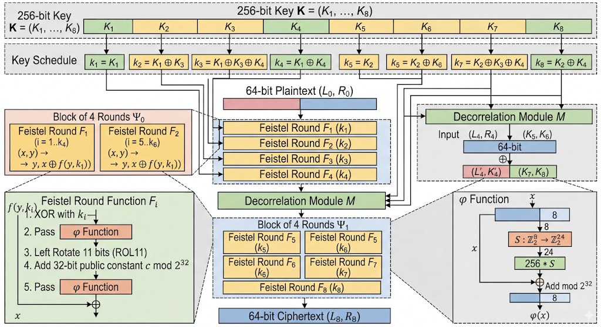

# Solution writeup here

The boomerang attack is a differential attack that attempts to generate a "quartet" structure at an intermediate value halfway through the cipher.

## Differential Cryptanalysis

This branch of cryptanalysis is relatively new, dating back to DES. Differential cryptanalysis is efficient when the cryptanalyst can choose plaintexts and obtain ciphertexts, also known as chosen plaintext cryptanalysis or an oracle.


# COCONUT98 - Cipher Structure & Boomerang Attack
## Overview

COCONUT98 is a 64-bit block cipher with a 256-bit key, designed by Vaudenay using **decorrelation theory** : a technique intended to give provable security against differential attacks. Despite a proof that no differential characteristic for the _full cipher_ has probability better than $\approx 2^{-64}$, Wagner (FSE 1999) broke it with only $2^{16}$ adaptive chosen plaintext/ciphertext queries using the **boomerang attack**.

The cipher is defined as:

$$E = \Psi_1 \circ M \circ \Psi_0$$

where:

- $\Psi_0$ : four Feistel rounds (rounds 1–4)
- $M$ : a decorrelation module (affine map over $\mathrm{GF}(2^{64})$)
- $\Psi_1$ : four more Feistel rounds (rounds 5–8)

---

## Key Schedule

The master key is $K = (K_1, K_2, K_3, K_4, K_5, K_6, K_7, K_8)$ where each $K_i \in \mathbb{Z}_2^{32}$ (32 bits), giving 256 bits total.

The eight round subkeys $k_1, \ldots, k_8$ are:

|Round $i$|1|2|3|4|5|6|7|8|
|---|---|---|---|---|---|---|---|---|
|$k_i$|$K_1$|$K_1 \oplus K_3$|$K_1 \oplus K_3 \oplus K_4$|$K_1 \oplus K_4$|$K_2$|$K_2 \oplus K_3$|$K_2 \oplus K_3 \oplus K_4$|$K_2 \oplus K_4$|
|Half|$\Psi_0$|$\Psi_0$|$\Psi_0$|$\Psi_0$|$\Psi_1$|$\Psi_1$|$\Psi_1$|$\Psi_1$|

The decorrelation module $M$ consumes the remaining four key words $K_5, K_6, K_7, K_8$.

> [!warning] Key Schedule Weakness $K_3$ and $K_4$ are **shared across both Feistel halves.** The schedule is a perfect mirror: $\Psi_0$ uses $(K_1, K_3, K_4)$ and $\Psi_1$ uses $(K_2, K_3, K_4)$. This symmetry is directly exploited in the boomerang key recovery : recovering $K_3$ from one half immediately constrains the other.

---

## Feistel Round Function

Each $\Psi_i$ consists of four rounds of the same Feistel function $F_i$.

### Round structure

For a 64-bit block split as $(x, y)$ where $x, y \in \mathbb{Z}_2^{32}$:

$$F_i(x,\ y) = \bigl(y,; x \oplus \varphi!\bigl(\mathrm{ROL}_{11}(\varphi(y \oplus k_i)) + c \bmod 2^{32}\bigr)\bigr)$$

The two halves simply swap on every round (standard Feistel), with the right half $y$ transformed through the round function before XORing into the left.

### The φ function

$$\varphi(x) = x + 256 \cdot S(x \bmod 256) \bmod 2^{32}$$

where:

- $S : \mathbb{Z}_2^8 \to \mathbb{Z}_2^{24}$ is a fixed public S-box (8-bit input, 24-bit output used as an integer)
- The multiplication by 256 shifts the S-box output left by 8 bits before adding

### Components

|Symbol|Description|
|---|---|
|$\mathrm{ROL}_{11}(\cdot)$|Left-rotate a 32-bit word by 11 bit positions|
|$c$|Public 32-bit constant (not a secret)|
|$S$|Fixed public S-box $\mathbb{Z}_2^8 \to \mathbb{Z}_2^{24}$|
|$k_i$|Round subkey for round $i$, derived per the key schedule above|

### Full $\Psi$ halves

$$\Psi_0 = F_4 \circ F_3 \circ F_2 \circ F_1$$

$$\Psi_1 = F_8 \circ F_7 \circ F_6 \circ F_5$$

Note: same $F_i$ function in both halves : only the subkeys differ.

---

## Decorrelation Module

$$M(xy) = (xy \oplus K_5 K_6) \times K_7 K_8 \bmod \mathrm{GF}(2^{64})$$

where $xy$ denotes the 64-bit concatenation $L_4 | R_4$ of the Feistel output.

- $K_5 | K_6$ acts as a 64-bit **additive** key (XOR before multiply)
- $K_7 | K_8$ acts as a 64-bit **multiplicative** key in $\mathrm{GF}(2^{64})$

$M$ is an **affine map** over $\mathrm{GF}(2^{64})$. This means:

$$M(a) \oplus M(b) = M(a \oplus b)$$

for any fixed key. Equivalently, for any fixed key there is a differential $\delta \to \delta$ for $M^{-1}$ with probability exactly 1 : the attacker doesn't need to know what $\delta$ is, only that it depends on the key alone and not on the data values.

> [!info] Decorrelation Security Claim Vaudenay proved that every differential $\delta \to \delta$ for the **full cipher** $E$ with $\delta, \delta \neq 0$ has average probability $\frac{1}{2^{64} - 1}$ over all key values. This appears to rule out differential attacks.

> [!danger] Why the Proof Doesn't Save It The proof averages over **all keys** and considers the **full cipher**. It says nothing about differential characteristics through only **half** the cipher at a fixed unknown key. Wagner's attack never pushes a differential through $M$ : it sidesteps the module entirely using the boomerang quartet structure.

---

## Differential Characteristics for $\Psi_0$

Let $e_j = 2^j$ denote the 32-bit value with only bit $j$ set (a single-bit XOR difference).

### Key observation

The round function satisfies:

$$e_j \xrightarrow{F_i} e_{j+11} \quad \text{with probability } \frac{1}{2}$$

for $j \in J = {8, 9, \ldots, 20, 29, 30, 31}$ (subscripts mod 32).

This holds because $\mathrm{ROL}_{11}$ shifts a single-bit difference from position $j$ to position $j + 11$, and the carry arithmetic in $\varphi$ can be controlled for these bit positions without requiring independent control of all three carry chains (they are not independent, unlike a naive analysis would suggest).

For two-bit differences:

$$e_j \oplus e_k \xrightarrow{F_i} e_{j+11} \oplus e_{k+11} \quad \text{with probability } \frac{1}{4}, \quad j,k \in J,\ j \neq k$$

### Example 4-round characteristic for $\Psi_0$

$$ (e_{19},\ e_{18} \oplus e_8) ;\xrightarrow{F_1}; (e_{18} \oplus e_8,\ e_{29}) ;\xrightarrow{F_2}; (e_{29},\ e_{18}) ;\xrightarrow{F_3}; (e_{18},\ 0) ;\xrightarrow{F_4}; (0,\ e_{18}) $$

Probability: $\approx 0.83 \cdot 2^{-4} \approx 2^{-4.3}$

The same structure gives equally good characteristics for $\Psi_1^{-1}$ by symmetry.

---

## Boomerang Attack

### Generic setup

Decompose the cipher as $E = E_1 \circ E_0$ where $E_0 = \Psi_0$ and $E_1 = \Psi_1 \circ M$.

Choose input difference $\Delta$ and "return" difference $\nabla$. For COCONUT98, use:

$$\Delta = \nabla = (e_{10},\ e_{31})$$

**Query construction:**

1. Choose plaintext $P$, set $P' = P \oplus \Delta$
2. Encrypt: obtain $C = E(P)$ and $C' = E(P')$
3. Set $D = C \oplus \nabla$ and $D' = C' \oplus \nabla$
4. Decrypt: obtain $Q = E^{-1}(D)$ and $Q' = E^{-1}(D')$

The four texts $(P, P', Q, Q')$ form a **right quartet** when all four differential characteristics hold simultaneously.

### Why M is bypassed

The boomerang quartet condition reduces to:

$$E_0(Q) \oplus E_0(Q') = \Delta^*$$

regardless of what $M$ does. Since $M$ is affine, $M^{-1}$ maps any ciphertext difference to a data-independent (key-only) plaintext difference : the attacker doesn't need to know the value, only that it is consistent across both pairs. The quartet structure guarantees cancellation.

Formally, the success probability per quartet is:

$$p \approx \left( \sum_{\Delta} \Pr[\Delta \to \Delta \text{ by } \Psi_0]^2 \right)
          \cdot \left( \sum_{\nabla} \Pr[\nabla \to \nabla \text{ by } \Psi_1^{-1}]^2 \right)$$

Empirically, $\Delta = \nabla = (e_{10}, e_{31})$ gives:

$$p \approx 0.023 \times 0.023 \approx \frac{1}{1900}$$

Using a 1-round peel attack (requiring $Q \oplus Q' = (?,\ e_{31})$) improves this to $p \approx \frac{1}{950}$.

### Distinguisher complexity

A distinguisher requires at most $950 \times 4 = 3800$ adaptive chosen plaintext/ciphertext queries.

### Key recovery

The attack peels off one round per iteration:

**Step 1 : Recover $K_1$:** Guess $K_1$, decrypt one round from $P, P'$ and $Q, Q'$. If the quartet is right, the XOR difference after round 1 must be $(e_{31}, 0)$ for both pairs. Wrong key guesses fail this test with probability $\frac{1}{2}$, so each of the $\approx 16$ useful quartets provides 1 bit of filtering on $K_1$. After 16 quartets, $K_1$ is identified.

**Step 2 : Recover $K_2 \oplus K_4$:** Decrypt one round inward from the ciphertext side (pairs $C, D$ and $C', D'$). Analogous filtering recovers $K_2 \oplus K_4$.

**Step 3 : Iterate:** With outer rounds peeled, the reduced cipher has higher success probability ($p \approx \frac{1}{144}$). Repeat to recover $K_3$, then the remaining key words.

### Full complexity

$$\text{Data: } 16 \cdot 950 \cdot 4 + 8 \cdot 144 \cdot 4 + \cdots \approx 2^{16} \text{ adaptive CP/CC queries}$$

$$\text{Time: } 8 \cdot 2 \cdot 32 \cdot 2^{32} = 2^{41} \text{ evaluations of } F \approx 2^{38} \text{ trial encryptions}$$

Compare to the best conventional (meet-in-the-middle) attack, which requires $\approx 2^{96}$ trial encryptions.

---

## Encryption Flow (Summary)

```
Plaintext  (L₀ ‖ R₀)   64-bit block
        │
        ▼
┌─────────────────────────────────────────────────────┐
│  Ψ₀  =  F₄ ∘ F₃ ∘ F₂ ∘ F₁    (rounds 1–4)          │
│                                                     │
│  k₁ = K₁                                           │
│  k₂ = K₁ ⊕ K₃                                     │
│  k₃ = K₁ ⊕ K₃ ⊕ K₄                                │
│  k₄ = K₁ ⊕ K₄                                     │
│                                                     │
│  Fᵢ(x,y) = (y, x ⊕ φ(ROL₁₁(φ(y⊕kᵢ)) + c mod 2³²)) │
│  φ(x)    = x + 256·S(x mod 256) mod 2³²            │
└─────────────────────────────────────────────────────┘
        │  (L₄, R₄)
        ▼
┌─────────────────────────────────────────────────────┐
│  M(xy) = (xy ⊕ K₅K₆) × K₇K₈  mod GF(2⁶⁴)          │
│  affine map : bypassed by boomerang quartet          │
└─────────────────────────────────────────────────────┘
        │  (L₄', R₄')
        ▼
┌─────────────────────────────────────────────────────┐
│  Ψ₁  =  F₈ ∘ F₇ ∘ F₆ ∘ F₅    (rounds 5–8)          │
│                                                     │
│  k₅ = K₂                                           │
│  k₆ = K₂ ⊕ K₃                                     │
│  k₇ = K₂ ⊕ K₃ ⊕ K₄                                │
│  k₈ = K₂ ⊕ K₄                                     │
│                                                     │
│  (same Fᵢ structure : K₁ replaced by K₂,           │
│   K₃ and K₄ shared with Ψ₀)                        │
└─────────────────────────────────────────────────────┘
        │  (L₈, R₈)
        ▼
Ciphertext  (L₈ ‖ R₈)   64-bit block
```
Source: Claude

---

## Design Lesson

COCONUT98 demonstrates that **eliminating all high-probability differentials for the full cipher is not sufficient** to guarantee security against differential-style attacks. The boomerang technique shows that:

- A characteristic of probability $q$ for **half** the cipher suffices for an attack needing $O(q^{-4})$ queries
- In COCONUT98, $q \approx 2^{-4}$ gives $O(2^{16})$ : far below the $2^{64}$ implied by the decorrelation proof
- The decorrelation module provides real benefit. Without it, conventional differential attacks work in $\approx 2^8$ queries, so the module roughly **squares** the security level of the base cipher, just not to $2^{64}$
- The fix would require either significantly more Feistel rounds per half, or a decorrelation module embedded **within each round** (as in the DFC AES submission)

---

## References

- Wagner, D. (1999). [_The Boomerang Attack_](https://link.springer.com/content/pdf/10.1007/3-540-48519-8_12.pdf).
- Vaudenay, S. (1998). [_Provable Security for Block Ciphers by Decorrelation_](https://link.springer.com/chapter/10.1007/BFb0028566). (COCONUT98 original design)


### Good visual reference



