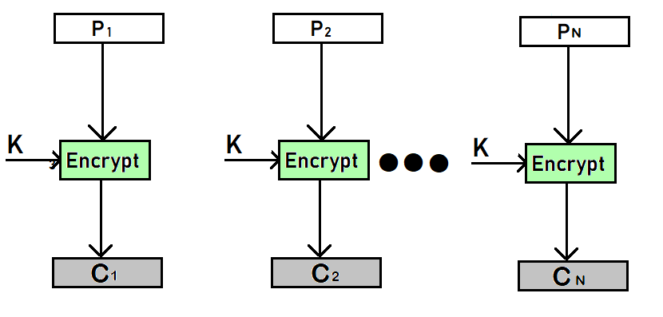
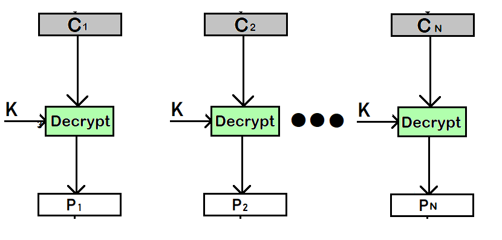

# ECBeast

Example run from `solution/solve.py`:

```bash
supasuge:solution/ $ python solve.py
[*] ============================================================
[*] ECBeast Solver - ECB Byte-at-a-Time Oracle Attack
[*] ============================================================
[+] Opening connection to localhost on port 1337: Done
[*] Waiting for banner...
[+] Connected to oracle
[*] Discovering padding character...
[+] Found padding character: '!' (0x21)
[*] Starting byte-at-a-time attack (expecting 32 bytes)...
[*] [ 1/32] Found byte: 'G' -> G
[*] [ 2/32] Found byte: 'R' -> GR
[*] [ 3/32] Found byte: 'I' -> GRI
[*] [ 4/32] Found byte: 'Z' -> GRIZ
[*] [ 5/32] Found byte: 'Z' -> GRIZZ
[*] [ 6/32] Found byte: '{' -> GRIZZ{
[*] [ 7/32] Found byte: 'n' -> GRIZZ{n
[*] [ 8/32] Found byte: '0' -> GRIZZ{n0
[*] [ 9/32] Found byte: '_' -> GRIZZ{n0_
[*] [10/32] Found byte: '1' -> GRIZZ{n0_1
[*] [11/32] Found byte: 'v' -> GRIZZ{n0_1v
[*] [12/32] Found byte: '_' -> GRIZZ{n0_1v_
[*] [13/32] Found byte: 'n' -> GRIZZ{n0_1v_n
[*] [14/32] Found byte: '0' -> GRIZZ{n0_1v_n0
[*] [15/32] Found byte: '_' -> GRIZZ{n0_1v_n0_
[*] [16/32] Found byte: 's' -> GRIZZ{n0_1v_n0_s
[*] [17/32] Found byte: '3' -> GRIZZ{n0_1v_n0_s3
[*] [18/32] Found byte: 'c' -> GRIZZ{n0_1v_n0_s3c
[*] [19/32] Found byte: 'u' -> GRIZZ{n0_1v_n0_s3cu
[*] [20/32] Found byte: 'r' -> GRIZZ{n0_1v_n0_s3cur
[*] [21/32] Found byte: '1' -> GRIZZ{n0_1v_n0_s3cur1
[*] [22/32] Found byte: 't' -> GRIZZ{n0_1v_n0_s3cur1t
[*] [23/32] Found byte: 'y' -> GRIZZ{n0_1v_n0_s3cur1ty
[*] [24/32] Found byte: '_' -> GRIZZ{n0_1v_n0_s3cur1ty_
[*] [25/32] Found byte: '3' -> GRIZZ{n0_1v_n0_s3cur1ty_3
[*] [26/32] Found byte: 'c' -> GRIZZ{n0_1v_n0_s3cur1ty_3c
[*] [27/32] Found byte: 'b' -> GRIZZ{n0_1v_n0_s3cur1ty_3cb
[*] [28/32] Found byte: '_' -> GRIZZ{n0_1v_n0_s3cur1ty_3cb_
[*] [29/32] Found byte: 'l' -> GRIZZ{n0_1v_n0_s3cur1ty_3cb_l
[*] [30/32] Found byte: '0' -> GRIZZ{n0_1v_n0_s3cur1ty_3cb_l0
[*] [31/32] Found byte: 'l' -> GRIZZ{n0_1v_n0_s3cur1ty_3cb_l0l
[*] [32/32] Found byte: '}' -> GRIZZ{n0_1v_n0_s3cur1ty_3cb_l0l}
[*] ============================================================
[+] Flag prefix verified: starts with 'GRIZZ{'
[+] FLAG: GRIZZ{n0_1v_n0_s3cur1ty_3cb_l0l}
[*] ============================================================
```

## Quick Recap of AES-ECB

In Electronic Codebook (ECB), each block of bits of plaintext is encoded independently with the same key.
- Plaintext is divided into fixed size blocks, usually b bits a piece, and then encrypted block by block, **all using the same key**. If the message is longer than the bock size, padding is applied to the last block as necessary.



As seen above and below, the plaintext, padded if needed, is segmented into b-bit blocks labeled $\text{P1}, $\text{P2}, ..., $\text{PN}$.



Key things to note for this challenge:
- ECB relies on simple substitution instead of an initialization vector and chaining. When two blocks of plaintext are identical, they result in two corresponding blocks of ciphertext.

## Overview

This challenge demonstrates class ECB (Electronic Codebook) byte-at-a-time oracle attack. A fundamental cryptographic vulnerability that arises when user-controlled input is concatenated with secret data before encryption.

### Setup (Core encryption logic)

```python
pad_char = secrets.choice(b"_#@!$%&*")
# Construct plaintext: user_input || flag
plaintext = user_bytes + flag

# Apply padding
padded_plaintext = pad_plaintext(plaintext, pad_char)

# Encrypt
cipher = AES.new(key[:16], AES.MODE_ECB)
ciphertext = cipher.encrypt(padded_plaintext)
```
From this encryption logic it's important to note that:
- We control `user_bytes` (arbitrary input)
- We want: `flag` (32 byte secret)
- We receive: `ciphertext` (hex-encoded)

### Parameters

```python
BLOCK_SIZE = 16  # AES block size (bytes)
PAD_BLOCK = 32   # Padding boundary - rounds up to nearest multiple of 32 bytes

# Single-byte padding character, chosen once per connection
pad_char = secrets.choice(b"_#@!$%&*")

# Create AES-ECB cipher (128-bit key)
cipher = AES.new(key[:16], AES.MODE_ECB)
```

### Padding function

```python
def pad_plaintext(plaintext: bytes, pad_char: int) -> bytes:
    """
    Pad plaintext to the next multiple of PAD_BLOCK bytes.
    If already aligned, adds a full PAD_BLOCK bytes of padding.
    """
    length = len(plaintext)
    if length % PAD_BLOCK == 0:
        pad_len = PAD_BLOCK  # Add full block when aligned
    else:
        pad_len = PAD_BLOCK - (length % PAD_BLOCK)
    
    return plaintext + bytes([pad_char]) * pad_len
```

### Why ECB is vulnerable

AES-ECB is deterministic, identical 16-byte plaintext blocks always encrypt to identical ciphertexts blocks under the same key:


```
Block 1: "AAAAAAAAAAAAAAAA" -> 0x3f7c9d... (always the same)
Block 2: "AAAAAAAAAAAAAAAA" -> 0x3f7c9d... (identical!)
```

This property allows an attacker who controls part of the plaintext to:

- Align secret bytes at predictable block positions
- Compare encrypted blocks across different queries
- Brute-force on byte at a time by matching block outputs

### The Attack Algorithm

**Step 1**: Discover the padding character

- The padding character is randomly selected from `_#@!$%&*.`. We need to identify it first before proceeding.

**Strategy**: Send 33 bytes of each candidate characters and look for matching blocks.


```text
Plaintext layout when sending 33 'x' characters:

-------------------------------------------------------------------------------
| x = 16| x = 16| x + flag[0:15] |x + flag[15:31]| flag[31] + pad*15 | pad*16 |
| blk 0 | blk 1 |     blk 2      |       blk 3   |        blk 4      | blk 5  |
-------------------------------------------------------------------------------
```

*Snippet from `solve.py`*

```python
from pwn import remote
def find_padding_char(r: remote) -> int:
    """
    Strategy:
    ---------
    Send enough copies of a candidate character to create recognizable patterns.
    If we send 33 bytes of character 'X', the plaintext becomes:
    
        X * 33 + flag(32 bytes) = 65 bytes
        Padded to 96 bytes = 31 bytes of padding
    
    Block layout (assuming 'X' is the padding character):
        Block 0: XXXXXXXXXXXXXXXX  (our input)
        Block 1: XXXXXXXXXXXXXXXX  (our input)
        Block 2: X + flag[0:15]    (1 byte input + 15 flag bytes)
        Block 3: flag[15:31]       (16 flag bytes)
        Block 4: flag[31] + XXXXXXXXXXXXXXX (1 flag + 15 padding)
        Block 5: XXXXXXXXXXXXXXXX  (16 padding bytes)
    
    If X == padding_char: blocks 0, 1, and 5 will all be identical!
    """
    PAD_CANDIDATES = b"_#@!$%&*"
    for candidate in PAD_CANDIDATES:
        payload = bytes([candidate]) * 33
        
        ct = oracle(r, payload)
        blocks = get_blocks(ct)
        
        # We expect at least 6 blocks (96 bytes / 16 bytes per block)
        if len(blocks) >= 6:
            # Check if blocks 0, 1, and 5 are identical
            if blocks[0] == blocks[1] == blocks[5]:
                return candidate
```
When `X == pad_char`
- Block 0 = `X * 16`
- Block 1 = `X * 16`
- Block 5 = `pad_char * 16` = `X * 16`

All three blocks are identical. This can be seen below as follows:

```python
python -c 'print("X"*33)' | python chal.py 
...
ct = '309913740d4332a6983e4aca1695d724309913740d4332a6983e4aca1695d7243c1c36b9d49ecf4a4fe1ed25c0a5dd03a523529c2aa32fc52ae4d177700edfaca8e4052a6180c2eae5647180372021da33e8dde25a074aedc5a825b9c6d39f3c'

blocks = [ct[i : i + 32] for i in range(0, len(ct), 32)]
print(blocks)
>>> [
    '309913740d4332a6983e4aca1695d724', 
    '309913740d4332a6983e4aca1695d724', 
    '3c1c36b9d49ecf4a4fe1ed25c0a5dd03', 
    'a523529c2aa32fc52ae4d177700edfac', 
    'a8e4052a6180c2eae5647180372021da', 
    '33e8dde25a074aedc5a825b9c6d39f3c']
```
Block 5: `33e8dde25a074aedc5a825b9c6d39f3c` = padding_char * 16

**But how do we know block 5 is all padding?**
Because of the $65$ -> $96$ padding math and the block alignment forced, the reason block $5$ becomes fully padded is:
- The last "real" plaintext (last flag byte) to land at the start of block $4$ (`F*1`)
- Leaves block $5$ untouched by flag or input, so it must be padding-only.
That’s what $33$ buys you:
    - $32$ would end your input exactly on block boundary, which changes the layout
    - $33$ forces the flag to start at position $1$ inside a block, and pushes the final padding into a clean full block
**Step 2**: Byte-at-a-time Recovery

For each position `i` in the `flag[0:31]`:
- Calculate the prefix length to align `flag[i]` at the end of the block.
- Query the oracle with that prefix to get a reference ciphertext
- Brute force all 256 possible bytes until we find a match

```python
prefix = b'GRIZZ{'
# we want len(prefix) + i \equiv BLOCK_SIZE -1 (mod BLOCK_SIZE)
# thus: prefix_len = (BLOCK_SIZE -1 -i) % BLOCK_SIZE)
prefix_len = (BLOCK_SIZE - 1 - i) % BLOCK_SIZE
# determine which block contains our target byte
# target block index = (prefix_len + i) // BLOCK_SIZE
target_block = (prefix_len + i) // BLOCK_SIZE
```

**Why this formula works**

We want `flag[i]` to be the last byte of some block. The block boundary occurs every 16 bytes.

```python
# Goal: Place flag[i] at the LAST position of a block (index 15 within any block)
#
# Block positions are 0-indexed:
#   Block 0: positions 0-15   (ends at 15)
#   Block 1: positions 16-31  (ends at 31)
#   Block 2: positions 32-47  (ends at 47)
#   ...
#
# A byte is at the "end of a block" when: position % 16 == 15
#
# The flag starts after our prefix, so:
#   position_of_flag[i] = prefix_len + i
#
# We want:
#   (prefix_len + i) % 16 == 15
#
# Rearranging for prefix_len:
#   prefix_len = (15 - i) % 16
#
# Which is equivalent to:
prefix_len = (BLOCK_SIZE - 1 - i) % BLOCK_SIZE

# Examples:
#   i=0  -> prefix_len = (15 - 0)  % 16 = 15  -> flag[0] lands at position 15 (True)
#   i=1  -> prefix_len = (15 - 1)  % 16 = 14  -> flag[1] lands at position 15 (True)
#   i=15 -> prefix_len = (15 - 15) % 16 = 0   -> flag[15] lands at position 15 (True)
#   i=16 -> prefix_len = (15 - 16) % 16 = 15  -> flag[16] lands at position 31 (True)
#   i=17 -> prefix_len = (15 - 17) % 16 = 14  -> flag[17] lands at position 31 (True)
```

**Step 3:** Recovery Loop

```python
def recover_flag(r, pad_char: int) -> bytes:
    flag = b""
    
    for i in range(FLAG_LEN):
        # Step 1: Calculate alignment
        prefix_len = (BLOCK_SIZE - 1 - i) % BLOCK_SIZE
        target_block_idx = (prefix_len + i) // BLOCK_SIZE
        
        # Step 2: Create prefix and get reference ciphertext
        prefix = b'A' * prefix_len
        ct_ref = oracle(r, prefix)
        blocks_ref = get_blocks(ct_ref)
        target_block = blocks_ref[target_block_idx]
        
        # Step 3: Brute-force the unknown byte
        # Prioritize printable characters since flags are usually printable
        candidates = list(range(32, 127)) + list(range(0, 32)) + list(range(127, 256))
        
        for guess in candidates:
            # Construct test payload: prefix + known_flag + guess_byte
            test_payload = prefix + flag + bytes([guess])
            
            ct_test = oracle(r, test_payload)
            blocks_test = get_blocks(ct_test)
            
            # Compare target block
            if blocks_test[target_block_idx] == target_block:
                flag += bytes([guess])
                break
    
    return flag
```

#### Visual Example Recovering `flag[0]`

Given: `i = 0`, `BLOCK_SIZE = 16`
- Calculate alignment:

```python
prefix_len = (16 - 1 - 0) % 16 = 15
target_block_idx = (15 + 0) // 16 = 0
```

- Reference Query: Send 15 As
- Plaintext layout:

```
┌─────────────────────────────────────────────────────────────────┐
│ A A A A A A A A A A A A A A A │ ? │ flag[1] ... flag[15] │ ...  │
│         Block 0 (15 A's + ?)  │   |      Block 1         │      │
└─────────────────────────────────────────────────────────────────┘
                                 ^
                                 |
                                 flag[0] (unknown)
```

- Test Query: For each guess `g`, send `'A' * 15 + g`
- Plaintext layout when testing guess `'G'`:

```
┌─────────────────────────────────────────────────────────────────┐
│ A A A A A A A A A A A A A A A │ G │ flag[0] ... flag[14]  │ ... │
│       Block 0 (15 A's + 'G')  │   |      Block 1          │     │
└─────────────────────────────────────────────────────────────────┘
```

**Comparison**:

- Reference Block 0: `AAAAAAAAAAAAAAA` + `flag[0]`
- Test Block 0: `AAAAAAAAAAAAAAA` + `g`

If `g == flag[0]`, both Block 0s are identical plaintexts -> identical ciphertexts!

- Visual Example: Recovering `flag[16]`
- Given: `i = 16`, `BLOCK_SIZE = 16`

**Calculate alignment**:

```python
prefix_len = (16 - 1 - 16) % 16 = (-1) % 16 = 15
target_block_idx = (15 + 16) // 16 = 31 // 16 = 1
```

**Reference Query**: Send 15 `A`s

**Plaintext layout**:
```
┌───────────────────────────────┬───────────────────────────────┬─────┐
│ A×15 + flag[0]                │ flag[1:17]                    │ ... │
│ Block 0                       │ Block 1 ← TARGET              │     │
└───────────────────────────────┴───────────────────────────────┴─────┘
```
Test Query: Send `'A' * 15 + flag[0:16] + g` (we already know `flag[0:16]`)

**Plaintext layout**:
```
┌───────────────────────────────┬───────────────────────────────┬─────┐
│ A×15 + flag[0]                │ flag[1:16] + g                │ ... │
│ Block 0                       │ Block 1 ← COMPARE             │     │
└───────────────────────────────┴───────────────────────────────┴─────┘
```
When `g == flag[16]`, Block 1 matches!

**Prefix Length Table**

| Byte Index `i` | `prefix_len` | `target_block_idx` | Block Contents (Reference) |
| :-: | :-: | :-: | :-: |
| 0 | 15 | 0 | `A×15 + flag[0]` | 
| 1 | 14 | 0 | `A×14 + flag[0:2]` |
| ... | ... | ... | ... |
| 15 | 0 | 0 | `flag[0:16]` |
| 16 | 15 | 1 | `flag[1:17]` |
| 17 | 14 | 1 | `flag[2:18]` |
|...|...|...|...|
| 31 | 0 | 1 | `flag[16:32]` |


#### Utility Functions

**Block Splitter**

```python
def get_blocks(data: bytes, block_size: int = BLOCK_SIZE) -> list:
    """Split data into blocks of specified size."""
    return [data[i:i+block_size] for i in range(0, len(data), block_size)]
```

**Oracle Interface**

```python
def oracle(r, payload: bytes, max_retries: int = 3) -> bytes:
    """
    Send a payload to the encryption oracle and receive the ciphertext.
    """
    for attempt in range(max_retries):
        try:
            # Wait for prompt and send payload
            r.sendlineafter(b"Submit your scroll fragment: ", payload, timeout=5)
            
            # Receive response
            r.recvuntil(b"Sealed scroll (hex):\n", timeout=5)
            ct_hex = r.recvline(timeout=5).strip().decode('ascii')
            
            return bytes.fromhex(ct_hex)
            
        except Exception as e:
            if attempt < max_retries - 1:
                time.sleep(0.1)
    
    raise RuntimeError(f"Oracle failed after {max_retries} retries")
```


##### Key Takeaways

- Never use ECB mode for encryption, if an attacker can control part of the plaintext, observe ciphertext, and repeat queries under the same key, then the secrecy collapses one byte at a time.
- Use CBC, GCM, or CTR modes with proper IV's/nonces (consider AEAD if needed).
- never prepend user input to secrets before encryption: this enables oracle attacks

##### Complexity

| Phase | Oracle Queries |
|             :-:             |      :-:       |
| Padding character detection | Up to $8$ queries |
| Flag recovery (per byte)    | $~47$ queries (avg, printable) |
| Total (32-byte flag)        | $~8 + 32 \times 47 \approx 1,512 \;\text{Queries}$ |

Worst case: 8 + 32*256 = 8,200 queries (if flag contains non-printable bytes)

###### References

- https://en.wikipedia.org/wiki/Block_cipher_mode_of_operation
- https://cryptopals.com/sets/2
    - Challenges 12 & 14 cover this exact attack
- https://blog.filippo.io/the-ecb-penguin/
    - Famous visual demonstration