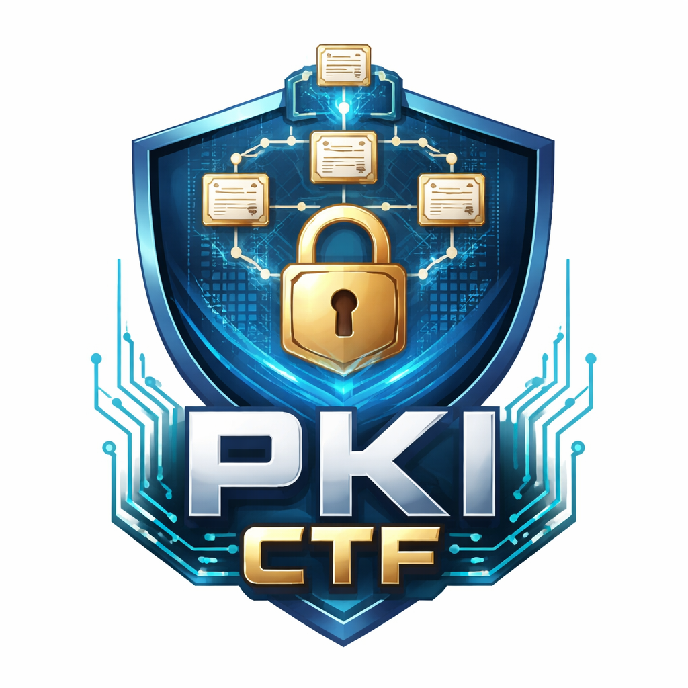

# Certainly

- **Author**: [supasuge](https://github.com/supasuge) | [Evan Pardon](https://linkedin.com/in/evan-pardon)
- **Difficulty**: Easy/Medium
- **Category**: Misc/Web

<p align="center"></p>

Root CA -> Intermediate CA -> Leaf Certificate Misconfiguration

---


## Deployment

To build the container on it's own:

```bash
docker build -t pki-ctf .
```

Or to build + run the container simply run `src/build.sh`

## Run the Container

```bash
docker run -d \
  --name pki-ctf \
  -p 80:80 \
  -p 443:443 \
  -e HOSTNAME=localhost \
  pki-ctf
```

For public deployment:

```bash
docker run -d \
  --name pki-ctf \
  -p 80:80 \
  -p 443:443 \
  -e HOSTNAME=challenge.example.com \
  --restart unless-stopped \
  pki-ctf
```

### Hint for participants

When connecting:
- `openssl s_client -connect target:443`

They'll observe:

```
verify error:num=20:unable to get local issuer certificate
```

## Challenge Overvieww

This challenges simulates a realistic Public Key Infrastructure (PKI) misconfiguration scenario involving:
- A Root Certificate Authority
- An Intermediate Certificate Authority
- A Leaf (server) Certificate
- An intentional misconfigured TLS deployment
- Flag embedded in a custom X.509 extension

Goal of the challenge is to investigate TLS certificate metadata, understand trust-of-chain mechanics, and follow an **Authority Information Access** Breadcrumb to recover the flag.

This isn't a simple "Inspect CN for the Flag" challenge. It's a structured PKI investigation requiring:
- TLS Certificate extraction
- X.509 extension parsing
- AIA resolution
- DER certificate decoding
- Custom OID analysis
- Base64 decoding

## Learning Objectives

1. **X.509 Cert Structure:**
- Subject vs. Issuer
- Certificate Hierarchy
- BasicConstraints
- KeyUsage
- SubjectAlternativeName
- Custom OID Extensions

2. Real-world TLS Misconfigurations

The server intentionally presents:

> Only the lead certificate (no intermediate chain)

This mimics real-world misconfigured servers, which occurs pretty often.

To solve this challenge, participants must understand why:

```
verify error:num=20:unable to get local issuer certificate
```

3. **Authority Information Access (AIA)**
- Certificates may contain URLs pointing to issuer certificates. 
- Clients can retrieve intermediate CAs via HTTP.
- AIA is a legitamate chain-building mechanism

4. **DER Vs. PEM Encoding**
- Download intermediate certificate in DER format
- Parse ASN.1 Structure
- Convert or interpret correctly

5. **Custom OID Extensions**
This teaches:
- X.509 extensibility
- Enterprise OID ranges
- Non-standard extension parsing

Challenge Design:

```
                 ┌────────────────────┐
                 │   Root CA (self)   │
                 │   (Not exposed)    │
                 └─────────┬──────────┘
                           │ signs
                 ┌─────────▼──────────┐
                 │ Intermediate CA    │
                 │ (Contains Flag)    │
                 └─────────┬──────────┘
                           │ signs
                 ┌─────────▼──────────┐
                 │ Leaf TLS Cert      │
                 │ (Served via Nginx) │
                 └─────────┬──────────┘
                           │
                 ┌─────────▼──────────┐
                 │  TLS Server (443)  │
                 │  HTTP AIA (80)     │
                 └────────────────────┘
```

Misconfiguration Explained

The TLS server presents:

Leaf certificate only

It does NOT include the intermediate CA in the chain.

Correct deployment would send:

leaf + intermediate

Instead, clients must:

1. Extract leaf certificate.
2. Parse AIA extension.
3. Fetch intermediate manually.

This models real-world enterprise TLS misconfiguration.

## Flag Placement

The flag is stored in the Intermediate CA as:

OID: `1.3.6.1.4.1.1337.42.1`

Value format:

```
BH-CTF:<base64(flag)>
```
Example:

```
BH-CTF:ZmxhZ3twcGtpX2FpYV9jaGFpbl9lZHVjYXRpb259
```

## Flag Format

```
GRIZZ{.......}
```
