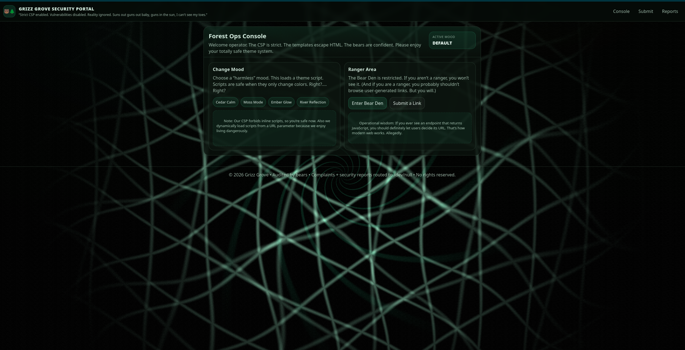

# GRIZZ GROVE — “CSP Fixed XSS” (it didn’t)

- **Author**: [supasuge](https://github.com/supasuge) | Evan Pardon  
- **Category**: Web  
- **Difficulty**: Medium  
- **Challenge Title**: Grizz Grove



## Overview

Strict CSP is enabled (`script-src 'self'`). Inline scripts are blocked. Templates escape HTML.  
Then someone ships a “mood/theme” loader that dynamically injects a `<script src=...>` from a URL parameter.  
There’s also a same-origin JSONP endpoint. The ranger-bot visits user-submitted paths with a privileged cookie.

Goal: steal the flag from the ranger-only Bear Den via the bot flow.

After reviewing this heavily vibe-coded application... there are multiple ways to get the flag to be honest, however I'll leave that to the participants to find lol.

## Handout contents

- `grizz-grove.tar.xz`: Contains everything in `/src` except the player is given `flag.txt.example` (fake flag)


## Build (Docker)

From `src/`:

```bash
docker build -t grizz-grove .
```

## Run (Docker)

```bash
docker run --rm -p 1337:1337 grizz-grove
```

Open (this will be different in production environment with actual domain name or just an IP depending on how lazy im feeling):

- [http://127.0.0.1:1337/](http://127.0.0.1:1337/)


## Solve (reference)

From repo root:

```bash
python solution/solve.py http://127.0.0.1:1337
# output and flag format as always
GRIZZ{....}
```

## Notes

- Reports are **ticketed + one-time**. Once viewed, they clear automatically.
- Default ports/paths assume local testing. Adjust via env vars in `src/Dockerfile` if needed.
