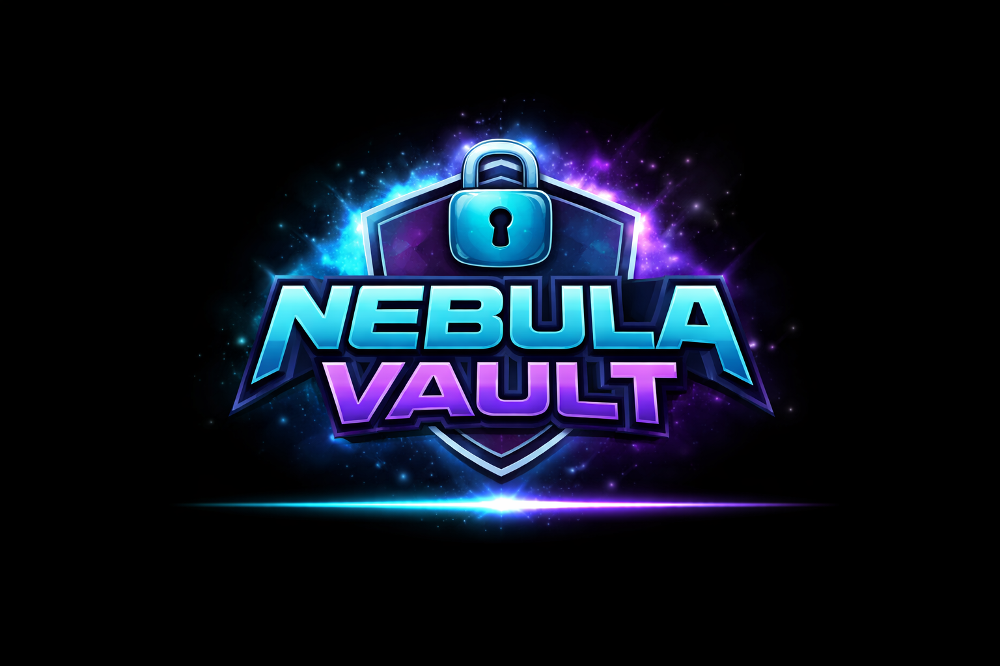

# Nebula Vault

<p align="center"></p>

- **Author**: [supasuge](https://github.com/supasuge) | [Evan Pardon](https://linkedin.com/in/evan-pardon)
- **Category**: Web  
- **Difficulty**: Easy 

## Challenge Description

Welcome to **Nebula Vault**, an internal badge registration portal.

To activate your Nebula ID, you must:

1. Register a callsign  
2. Upload a profile avatar  

Your avatar is securely displayed via a session-bound endpoint.

However…

There is also an internal “Vault” file viewer used to retrieve stored artifacts.  
If you can make it retrieve something it was never meant to expose, you may uncover the flag.

Your objective is to retrieve the flag stored on the server.

---

## Build & Run

Simply run the script:

```bash
# make sure your in /src
./run.sh
```

- Checks for docker availability + docker-daemon
- Builds & Runs container
- Exposes port `6969`

## Build (manual)

```bash
docker build -t nebula-vault .
```

## Run (manual)

```bash
docker run --rm -d -p 6969:6969 nebula-vault
```

---

## Handout

`handout/nebula-vault.tar.xz`

Contains:

```bash
src/
src/uploads/
src/static/
src/static/style.css
src/templates/
src/templates/profile.html
src/templates/base.html
src/templates/index.html
src/flag.txt                    # This has been replaced with a fake flag for local testing
src/requirements.txt
src/Dockerfile
src/app.py
src/run.sh
```

### Flag format

```
GRIZZ{....}
```